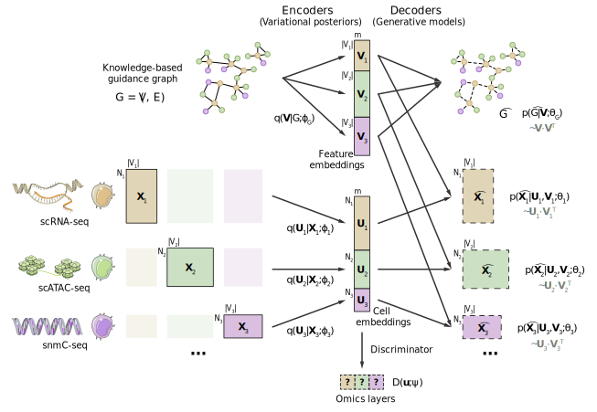

# GLUE (Graph-Linked Unified Embedding)

[](https://opensource.org/licenses/MIT)
[](https://pypi.org/project/scglue)
[](https://scglue.readthedocs.io/en/latest/?badge=latest)
[](https://github.com/gao-lab/GLUE/actions/workflows/build.yml)
[](https://github.com/gao-lab/GLUE/actions/workflows/build.yml)

Graph-linked unified embedding for single-cell multi-omics data integration



For more details, please check out our [preprint](https://www.biorxiv.org/content/10.1101/2021.08.22.457275).

## Directory structure

```
.
├── scglue                  # Main Python package
├── data                    # Data files
├── evaluation              # Method evaluation pipelines
├── experiments             # Experiments and case studies
├── tests                   # Unit tests for the Python package
├── docs                    # Documentation files
├── custom                  # Customized third-party packages
├── packrat                 # Reproducible R environment via packrat
├── env.yaml                # Reproducible Python environment via conda
├── setup.py                # Setup script for the Python package
├── LICENSE
└── README.md
```

## Package installation

It is recommended to install `scglue` within a
[conda](https://docs.conda.io/en/latest/miniconda.html) environment.

First, initialize an empty conda environment (here named "scglue"):

```sh
conda env create -n scglue "python>=3.6" && conda activate scglue
```

Then, install scglue via:

```sh
pip install scglue
```

## Package usage

Please checkout the documentations and tutorials at
[scglue.readthedocs.io](https://scglue.readthedocs.io).

## Package development

Install scglue in editable form via flit:

```sh
pip install flit && flit install -s
```

Run unit tests:

```sh
pytest --cov="scglue" --cov-report="term-missing" tests [--cpu-only]
```

Build documentation:

```sh
sphinx-build -a -b html docs docs/_build
```

## Reproduce results

1. Checkout the repository to v0.1.1:

   ```sh
   git checkout tags/v0.1.1
   ```

2. Create a local conda environment using the `env.yaml` file,
and then install scglue:

   ```sh
   conda env create -p conda -f env.yaml && conda activate ./conda
   flit install -s
   ```

3. Set up a project-specific R environment:

   ```R
   packrat::restore()  # Packrat should be automatically installed if not available.
   install.packages("data/download/Saunders-2018/DropSeq.util_2.0.tar.gz", repos = NULL)
   install.packages("custom/Seurat_4.0.2.tar.gz", lib = "packrat/custom", repos = NULL)
   ```

   > R 4.0.2 was used during the project, but any version above 4.0.0 should be compatible.

4. Follow instructions in `data` to prepare the necessary data.
5. Follow instructions in `evaluation` for method evaluation.
6. Follow instructions in `experiments` for case studies.
